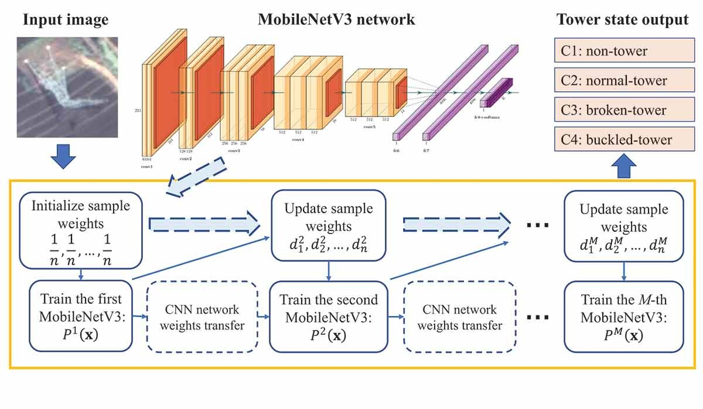
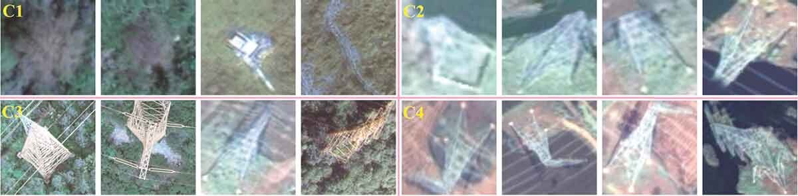
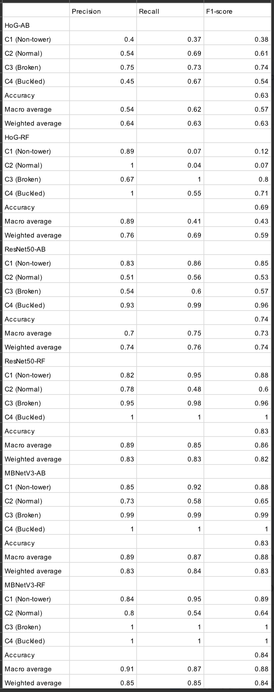

# Adaboost-MobileNetV3

Inspired by the AdaBoost-CNN: An Adaptive Boosting algorithm for Convolutional Neural Networks to classify Multi-Class Imbalanced datasets using Transfer Learning

For All use of the data, please 'cite' the following:

'Aboozar Taherkhani, Georgina Cosma, T.M McGinnity. AdaBoost-CNN: An Adaptive Boosting algorithm for Convolutional Neural Networks to classify Multi-Class Imbalanced datasets using Transfer Learning, Neurocomputing'

The paper is avilabel at:
https://doi.org/10.1016/j.neucom.2020.03.064

# Model

# Dataset

# Results

